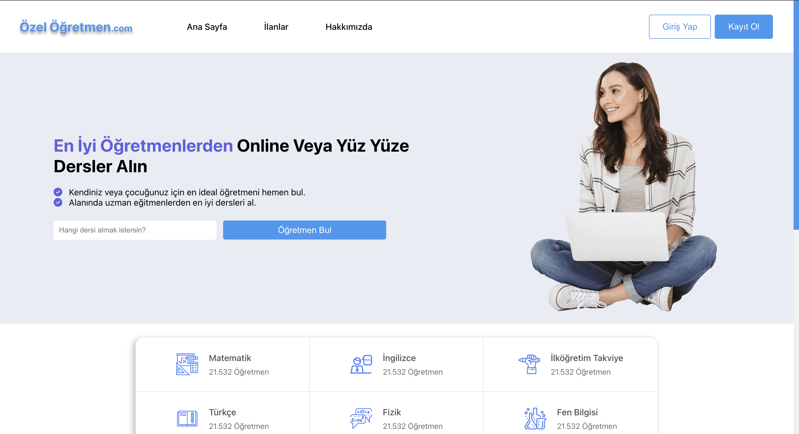
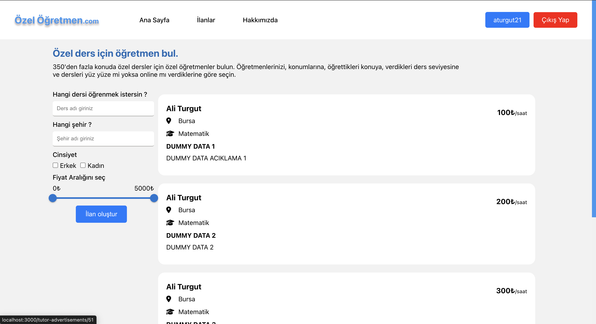
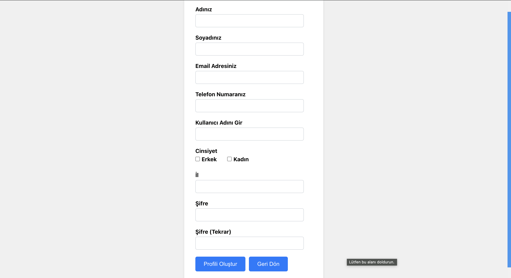
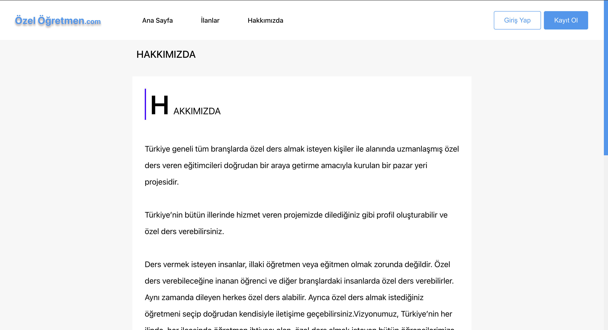
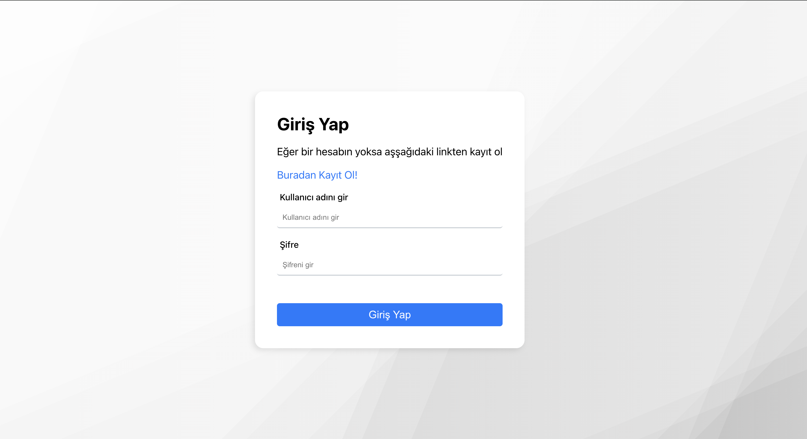
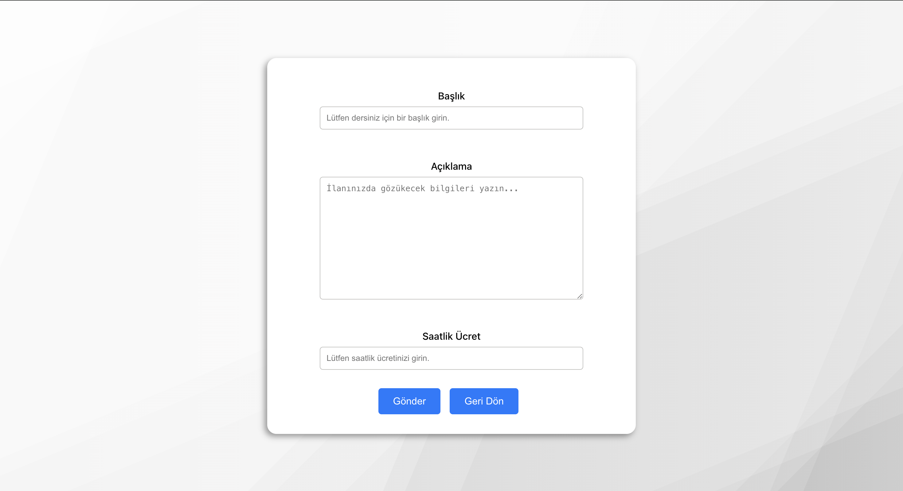

# Öğretmen-Öğrenci İletişim Platformu

Bu proje, yazılım mühendisliği dersinin dönem projesidir. Proje, Ali Turgut (Back-end), Ali Emir Şahin (Front-end), Abdulsamet Aydınhan (Front-end) ve Atalay Berk Çırak (Back-end) tarafından 4 kişi tarafından yapılmıştır.

Bu site, öğretmenler ile öğrencileri bir araya getiren bir platformdur. Öğretmenler siteye kayıt olabilir, profil sayfaları oluşturabilir ve ilanlar yayınlayarak öğrencilerle iletişime geçebilirler. Öğrenciler ise ilanları görüntüleyebilir ve öğretmenlerle iletişime geçebilir.

<div style="display: flex; flex-wrap: wrap;">
    
    
    
    
    
    
</div>


## Özellikler

- **Kayıt ve Giriş:** Öğretmenler siteye kayıt olup giriş yapabilirler.
- **Profil Sayfası:** Kayıt olan öğretmenler için profil sayfası oluşturulur.
- **İlan Yayınlama:** Öğretmenler ders vermek için ilan yayınlayabilirler.
- **İlan Güncelleme ve Silme:** Öğretmenler ilanlarını güncelleyebilir ve silebilirler.
- **Bilgi Güncelleme:** Öğretmenler kendi bilgilerini güncelleyebilirler.
- **Filtreleme:** Öğrenciler ilanları şehir, ders, cinsiyet ve fiyat aralığına göre filtreleyebilirler.
- **Öğrenci İlanı:** Öğrenciler ilan açamazlar, sadece öğretmenlerin ilanlarına başvurabilirler.

## Kullanılan Teknolojiler

- **Frontend:** React
- **Backend:** Java Spring Boot
- **Veritabanı:** MySQL
- **Frameworkler ve Kütüphaneler:** 
  - Spring Boot MVC
  - React Router

## Kurulum

1. Bu projeyi kendi bilgisayarınıza klonlayın:
    ```bash
    git clone https://github.com/kullaniciadi/proje-adi.git
    ```

2. **Backend** için gerekli bağımlılıkları yükleyin ve çalıştırın:
    ```bash
    cd backend
    ./mvnw install
    ./mvnw spring-boot:run
    ```

3. **Frontend** için gerekli bağımlılıkları yükleyin ve çalıştırın:
    ```bash
    cd frontend
    npm install
    npm start
    ```

4. MySQL veritabanını yapılandırın:
    - MySQL sunucusunu başlatın.
    - Gerekli veritabanı ve tabloları oluşturun.
    - `application.properties` dosyasındaki veritabanı bağlantı ayarlarını güncelleyin.

## Proje Yapısı

```plaintext
proje-adi/
│
├── backend/               # Spring Boot Backend
│   ├── src/
│   └── ...
│
├── frontend/              # React Frontend
│   ├── src/
│   └── ...
│
├── README.md              # Proje açıklamaları
└── ...
```
## Katkıda Bulunanlar
  - Ali Turgut(Back-end)
  - Ali Emir Şahin(Front-end)
  - Abdulsamet Aydınhan(Front-end)
  - Atalay Berk Çırak(Back-end)
